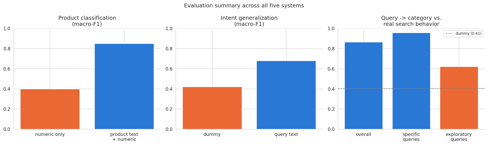

# Intent-Aware Recommendation System

[](https://github.com/ianlopezdiaz/intent-aware-recommendation-system/actions/workflows/ci.yml)
[](https://github.com/ianlopezdiaz/intent-aware-recommendation-system/actions/workflows/publish.yml)

An end-to-end machine learning project for intent-aware product recommendation using NLP, product classification, and hybrid recommender systems.

**[Read the full write-up](https://ianlopezdiaz.github.io/intent-aware-recommendation-system/)** (Quarto site, all six notebooks) · [Results](#results) below for the short version.

## Overview

Modern e-commerce platforms rely on search and recommendation systems to help users discover relevant products.
While some users know exactly what they are looking for, others are exploring the catalog with broader or less specific queries.
Understanding this search intent can significantly improve the quality of product recommendations.

This project investigates how search intent can be inferred from user queries and leveraged to build an intent-aware recommendation system.
The proposed solution combines supervised learning, unsupervised learning, natural language processing (NLP), and recommendation techniques into a single end-to-end pipeline.

The final system receives an arbitrary search query as input and:

- Predicts the most likely product category for the query.
- Infers the user's search intent (`specific` vs. `exploratory`).
- Recommends the ten most relevant products.

## Project Origin

This project is based on a technical challenge I was given during a Data Scientist recruitment process at **Elo7** in 2021. That process didn't lead to an offer, and my [original submission](https://github.com/ianlopezdiaz/ELO7-recruitment-test) was left unfinished.

The problem stuck with me, so I picked it back up as an independent project — this repository is a from-scratch implementation, not a continuation of that submission.

The original challenge description is included here for context and can be found in:

- [Original challenge (Brazilian Portuguese)](docs/elo7-ds-challenge-pt.md)
- [English translation](docs/elo7-ds-challenge-en.md)

## Results

Full reasoning, comparisons, and figures live in the notebooks (especially [`06_evaluation.ipynb`](notebooks/06_evaluation.ipynb), which brings all five systems together); this is the headline summary.



| System | Result | Baseline |
|---|---|---|
| Product classification (text + numeric features) | macro-F1 0.85 / accuracy 0.88 | 0.40 macro-F1, numeric features alone |
| Search intent generalization (query text only) | macro-F1 ~0.68 | ~0.42 macro-F1, majority-class dummy |
| Content-based recommendation (hit-rate@10 vs. historical clicks) | 86.0% | 1.4%, popularity alone |
| Query → category, no numeric features (Part 5's core constraint) | macro-F1 0.843, a text-only classifier | 0.849, the same pipeline with real numeric features (upper bound) |
| Query → category vs. **real historical search behavior** | 86.4% overall, 95.6% on `specific` queries, 62.0% on `exploratory` queries | 40.6%, always predict the most common category |

**The central question** — can search intent be inferred from the query alone — has a real, bounded answer: yes, to a measurable and honestly-limited degree. Product category is recoverable from a query's text almost as well as from a product's own title and tags (a 0.006 macro-F1 gap). A behavioral notion of intent (does a query's clicks concentrate in one category, or spread across several) is recoverable from query text alone at a meaningfully lower but still genuinely useful level, and knowing which kind of query it is changes both how much to trust the category prediction (95.6% vs. 62.0% accuracy) and how the recommender should behave (intent-aware diversification roughly doubles category diversity for broad queries, at a stated, deliberate cost in exact-match recall).

Two axes turned out *not* to be simply proxies for the same signal, worth surfacing here: the intent split correlates only weakly with price dispersion (r ≈ -0.16) and is essentially uncorrelated with query/product lexical overlap (r ≈ -0.02) — it captures something neither of the other two signals does.

## Repository Structure

```text
intent-aware-recommendation-system/
│
├── README.md                                   # Project overview and usage instructions.
├── index.qmd                                   # Landing page for the Quarto website.
├── _quarto.yml                                 # Quarto website configuration.
├── pyproject.toml                              # Project metadata and Python dependencies.
├── LICENSE                                     # Project license.
│
├── .github/
│   └── workflows/                              # CI (lint + notebook execution) and site publishing.
│
├── app/                                        # Command-line entry point.
│   └── cli.py                                      # `--category` / `--intent` / `--recommendation` (Part 6's delivery script).
│
├── data/                                       # Project datasets.
│   ├── raw/                                        # Original, immutable data.
│   │   └── elo7_recruitment_dataset.csv                # Original Elo7 recruitment challenge dataset.
│   └── processed/                              # Cleaned data, feature catalogs, and cached artifacts each notebook produces (tracked in git).
│
├── docs/                                       # Project documentation and challenge specification.
│   ├── elo7-ds-challenge-pt.md                     # Original challenge description (Brazilian Portuguese).
│   └── elo7-ds-challenge-en.md                     # English translation of the challenge description.
│
├── models/                                     # Trained model artifacts (gitignored; regenerate by running notebooks 02, 03, 05).
│
├── notebooks/                                  # Jupyter notebooks documenting the complete workflow.
│   ├── README.md                               # Notebook organization and execution order.
│   ├── 01_exploratory_data_analysis.ipynb          # Exploratory data analysis.
│   ├── 02_product_classification.ipynb             # Supervised product category classification.
│   ├── 03_search_intent_modeling.ipynb             # User search intent modeling.
│   ├── 04_recommendation_engine.ipynb              # Recommendation system development.
│   ├── 05_system_integration.ipynb                 # Integration of all system components.
│   └── 06_evaluation.ipynb                         # Cross-system evaluation and performance analysis.
│
├── reports/                                    # Generated reports and figures (e.g. 06_evaluation_summary.png).
│
├── src/                                        # Reusable source code, imported by the notebooks and `app/cli.py`.
│   ├── pipeline.py                             # The end-to-end query -> category/intent/recommendations pipeline.
│   ├── data/                                   # Loading raw/processed data, cleaning, deduplication.
│   ├── features/                               # Text and numerical feature engineering.
│   ├── models/                                 # Classifier, intent, and recommender pipeline builders.
│   ├── evaluation/                             # Evaluation metrics (recommender hit-rate/recall, category diversity).
│   └── utils/                                  # Shared helper functions.
│
└── _site/                                      # Website generated by Quarto (gitignored; published via `quarto publish gh-pages`).
    └── ...
```

## Installation

Requires Python 3.12+. From the repository root:

```shell
pip install -e ".[notebook]"
```

This installs the project's dependencies and the `src/` package in editable mode, so notebooks and scripts can `import src...` directly. The `notebook` extra adds Jupyter/`nbconvert`, needed to run and execute the notebooks (e.g. via `scripts/publish.sh`); omit it if you only need `src` as a library.

## Usage

Run the notebooks in order (01 through 06); each persists what the next one needs (see [`notebooks/README.md`](notebooks/README.md)). Once notebooks 02, 03, and 05 have produced their model artifacts, the command-line script is self-contained:

```shell
python app/cli.py --category "{'title': 'Anel de Prata', 'concatenated_tags': 'anel prata joia', 'price': 49.9, 'minimum_quantity': 1, 'weight': 5}"
python app/cli.py --intent "dia dos pais"
python app/cli.py --recommendation "anel de prata"
```

## Project Roadmap

- [x] Exploratory Data Analysis
- [x] Product Classification
- [x] Search Intent Modeling
- [x] Recommendation Engine
- [x] System Integration
- [x] Evaluation
- [ ] Interactive Demo

## License

This project is licensed under the MIT License.

The original challenge statement contained in `elo7-ds-challenge-pt.md` is provided solely for historical reference and remains the intellectual property of its original authors.

## References

- Dataset: provided by Elo7 for the original 2021 recruitment challenge (see [Project Origin](#project-origin)); a sample of real search-click events, product metadata, and category labels from the Elo7 marketplace.
- [Challenge specification](docs/elo7-ds-challenge-en.md) (English translation of the original Portuguese brief).
- Built with [scikit-learn](https://scikit-learn.org/) (TF-IDF, `LinearSVC`, `RandomForestClassifier`, `KMeans`), [pandas](https://pandas.pydata.org/), and [Quarto](https://quarto.org/) for the published site.
